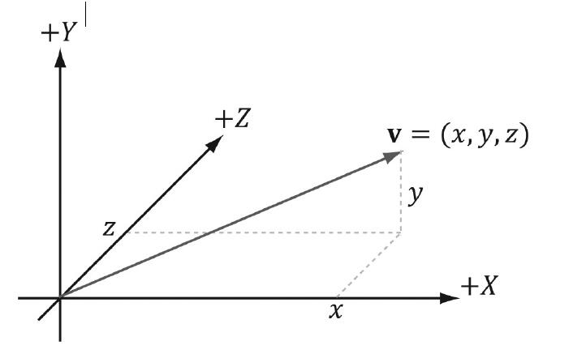
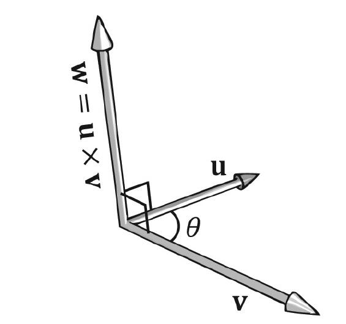

# 向量代数

[向量代数](#向量代数)
- [1.1 向量](#11-向量)      
   - - [1.1.1 向量和坐标系](#111-向量和坐标系)       
   - - [1.1.2 左手坐标系和右手坐标系](#112-左手坐标系和右手坐标系)        
   - - [1.1.3 基本的向量坐标运算](#113-基本的向量坐标运算)
- [1.2 长度和单位向量](#12-长度和单位向量)
- [1.3 点积](#13-点积)       
    - - [1.3.1 正交化](#131-正交化)    
- [1.4 叉积](#14-叉积)       
    - - [1.4.1 伪二维叉积](#141-伪二维叉积)        
    - - [1.4.2](#142)    
- [1.5 点](#15-点)    
- [1.6 DirectX Math 库的向量](#16-directx-math-库的向量)        
    - - [1.6.1 向量类型](#161-向量类型)        
    - - [1.6.2 加载方法和存储方法](#162-加载方法和存储方法)        
    - - [1.6.3 参数传递](#163-参数传递)        
    - - [1.6.4 常向量](#164-常向量)        
    - - [1.6.5 重载运算符](#165-重载运算符)       
    - - [1.6.6 预定于常量](#166-预定于常量)        
    - - [1.6.7 Setter 函数](#167-setter-函数)        
    - - [1.6.8 向量函数](#168-向量函数)     
    - - [1.6.9 浮点错误](#169-浮点错误)   
- [1.7 总结](#17-总结)
- [1.8 练习](#18-练习)

计算机图形，碰撞检测，物理模拟等都是现代电子游戏中常见的组成部分，而向量在其中扮演着至关重要的角色。我们在这里介绍的数学知识是不完备但实用的，而如果你真的想要学习 3D 游戏/图形的数学，我们推荐 《Verth04》 这本书。读者在本书的每个示例中都会看到一些注释，我们通过这些注释来强调向量的重要性。

**学习目标：**

1. 学习向量的几何表示方法和数值表示方法。
2. 学习向量运算和几何运用。
3. 熟悉 DirectXMath 库中，向量函数和向量类。

## 1.1 向量

向量是一个即有大小又有方向的物理量（quantity），同时具有大小和方向的物理量成为向量值物理量（vector-valued quantities）。常见的向量值物理量有 *力*，*位移*  和 *速度* 。因此，向量也常常用来表示力，位移和速度。另外，我们也用向量只表示方向，比如，玩家在 3D 游戏里的观察方向，多边形的朝向，光线传播的方向，或者光线从物体表明反射的方向。

首先，我们从几何学的角度描述向量的数学特征：从图像上，我们用一条有向线段表示向量（图 1.1），它的长度代表向量的大小，箭头表示方向。值得注意的是，我们画所画向量的位置是没有意义的，因为改变向量的位置，既不会改变它的大小，也不会改变它的方向。因此，两条向量当且仅当它们有相同的大小和方向时，我们说它们是相等的。可以判断，在图1.1a 中的向量 u 和 v 是相等的。事实上，正因为向量的位置是不重要的，我们能随意平移向量，而不会改变它的属性。注意，我们能平移 u 使它能与 v 完全重合（反之亦然），以致使它们彼此无法区分，因为它们是相等的。举一个物理上的例子，图1.1b 中的向量 u 和 v 描述两只蚂蚁从分别从 A、B 两点出发，向北移动 10 米。在这里，u = v。向量是独立于位置的，它们只描述蚂蚁从起点开始朝那个方向移动，移动了多远的距离。这个例子中，它们告诉蚂蚁向北移动 10 米。


### 1.1.1 向量和坐标系

现在，我们能定义在向量上的几何运算了，随后我们要用向量来解决各种向量值问题。不过，因为计算机不能解决通过几何的方式表示向量，所以，我们需要寻找一种替代方案，通过数值的方式表示向量。所以，我们引入空间坐标系，并且将所有向量的起点平移到坐标原点（图1.2）。然后，我们用向量终点坐标，表示这个向量，写作 *v=(x,y,z)* （图1.3）。现在，我们就能通过三个浮点数在计算中表示一个向量了！

> Note：如果是二维图像，我们只需要用二维坐标系就能表示向量，写作 v=(x,y)。在计算机中就用两个浮点数表示向量。


> 图1.2 平移v，使它的起点与原点重合。当一个向量起点与原点重合时，我们说该向量位于标准位置。


> 图1.3 向量终点坐标表示向量

看到图1.4，它展示了一个向量 v 以及空间中的两个坐标系。我们平移 v ，使它的起点分别与两个坐标系的原点重合。可以看到，向量 v 在框架A中的坐标不同于在框架B中的坐标。换而言之，同一个向量在不同的坐标系下，有不同的坐标。


> 图1.4

类似的概念还有，温度。水在 100 摄氏度下或 212 华氏度下沸腾。物理上的水的沸点都是一样的，不管在何种温度单位下，但是我们得根据我们选择的单位，指定不同的标量值去描述温度。同样地，对于向量，它的方向和大小被牢牢固定在有向线段中，不会改变；只有在以不同的坐标系去描述向量时，它的坐标才会改变。这点很重要，因为它意味着，无论何时我们通过坐标定义一个向量，这个坐标都是相对于坐标系的。通常在 3D 图形中，我们使用不止一个坐标系，所以必须保证向量坐标与对应坐标系一致；另外，我们需要知道如何将向量从一个坐标系变换到另一个坐标系。

> 我们能看到，向量和点在坐标系下都能使用坐标 (x,y,z) 去表示。但它们是不一样的；点代表了三维空间的一个位置，反之向量代表大小和方向。我们将在 1.5 节谈论更多有关点的知识。

### 1.1.2 左手坐标系和右手坐标系

Direct3D 使用了一种名为 *左手坐标系* 的坐标系统。原书在这里交代了如何用手比划坐标系，感觉更容易把人绕晕，直接看图来的直接一点（图1.5）。需要知道左手坐标系和右手坐标系唯一的区别就是z轴的方向，左手坐标系的z轴正方向指向屏幕里，右手坐标系的z轴正方向指向屏幕外。


> 图1.5，左边的是左手坐标系，右边的是右手坐标系

### 1.1.3 基本的向量坐标运算

现在，我们通过坐标来描述向量相等，加法运算，标量乘法运算和减法运算。

1. 向量相等：当且仅当它们的坐标分量相等时，向量相等。

> $$ u=v <=> u_x=v_x, u_y=v_y,u_z=v_z $$

2. 加法运算：两向量维度相同时，才能做加法，两向量相加等于两向量对应分量相加。

> $$ u=(u_x,u_y,u_z),v=(v_x,v_y,v_z),u+v=(u_x+v_x,u_y+v_y,u_z+v_z) $$

3. 标量乘法：一个标量与向量相乘，还是一个向量，设 k 为标量， u=(u<sub>x</sub>,u<sub>y</sub>,u<sub>z</sub>)，则

> $$ ku = (ku_x,ku_y,ku_z) $$

4. 向量减法：我们根据向量加法和标量乘法定义向量减法。

> $$ u-v = u + (-1*v) = u + (-v) = (u_x-v_x,u_y-v_y,u_z-v_z)$$

#### 例1.1

#### 例1.2

> 比较简单，暂不译

## 1.2 长度和单位向量

从几何角度，向量的大小就是有向线段的长度。我们用双垂线表示向量的大小（||u|| 表示 向量 u 的大小）。现在，给定一条向量 u=(x,y,z) ，我们希望通过代数的方法计算它的大小。三维向量的大小能通过使用两次毕达哥斯拉定理计算出来。如图1.8

> 毕达哥斯拉定理就是勾股定理


> 图1.8

首先，观察 XZ 平面，由直角边x，z，斜边 a 组成的直角三角形，通过毕达哥斯拉卡定理，我们有：

> $$ a = \sqrt{x^2+z^2} $$

然后，观察，由直角边 a ， y ，斜边 ||u|| 组成的直角三角形，再此使用毕达哥斯拉定理，我们得到如下的求模公式：

> $$ ||u||= \sqrt{y^2+a^2}=\sqrt{y^2+(\sqrt{x^2+z^2})^2} = \sqrt{x^2+y^2+z^2}$$

在有些情况中，我们不关心向量的大小，我们只关心用向量表示一个方向。对于这种只有方向的向量，我们规定它的大小始终为 1 。当我们想要让一个向量具有单位长度时，我们说要对该向量进行规范化。我们将向量的每个分量除以该向量的模，得到单位向量。

> $$ \overline{u} = {u\over ||u||} = (x/||u||,y/||u||,z/||u||)$$

为了证明这个公式是正确的，我们计算单位向量u的长度

>$$ ||\overline{u}|| = \sqrt{({x\over ||u||})^2+({y\over ||u||})^2+({z\over ||u||})^2} = {\sqrt{x^2+y^2+z^2}\over \sqrt{||u||^2}} = {||u||\over ||u||} = 1 $$

#### 例1.3

> 暂时不译

## 1.3 点积

点积是向量乘法的一种形式，它的结果是一个标量；正因如此，点积有时也被成为标量积。令 u=(u<sub>x</sub>,u<sub>y</sub>,u<sub>z</sub>)，v=(v<sub>x</sub>,v<sub>y</sub>,v<sub>z</sub>)，点积的定义为（等式1.3）：

> $$ u·v = u_xv_x + u_yv_y + u_zv_z $$

总之，点积等于两个向量对应分量的乘积之和。点积的定义不存在任何明显的几何含义。但是，使用余弦定理可以发现存在如下关系（等式1.4）：

> $$ u·v = ||u||||v||cos \Theta $$


> 图1.9 在左图，u、v之间的夹角为锐角。在右图，u、v之间的夹角为钝角。当我们提及两个向量之间的夹角时，通常指的是最小的角。

θ 角是向量 u 和 v 的夹角，取值范围是 0 ≤ θ ≤ π；（如图1.9）。根据等式1.4，两个向量的点积等于向量夹角的余弦值乘两向量的模。特殊地，如果两向量都是单位向量，u·v 就等于它们夹角的余弦值。

等式1.4 可以推导出如下点积有用的几何性质：

1. 如果 u · v = 0, 那么 u ⊥ v (这两个是正交向量)。
2. 如果 u · v > 0, 那么 两向之间的夹角是锐角
3. 如果 u · v < 0, 那么 两向之间的夹角是钝角

#### 例1.4

#### 例1.5

> 暂时不译

### 1.3.1 正交化

当一个向量集 {v<sub>0</sub>, ..., v<sub>n-1</sub>} 中所有向量都是单位向量，且相互正交时，我们称这个向量集为标准正交基（orthonormal）

> 未完

## 1.4 叉积

叉积是向量数学定义的第二种乘法形式。与点积不同，点积的结果是标量，叉积的结果是另一个向量。而且，叉积运算只对三维向量有意义（特别地，二维向量是没有叉积运算的）。两个三维向量 u 和 v 做叉积运算会产生第三个向量 w，w 向量与 u ，v 向量相互正交。也就是说，w 即垂直于 u，也垂直于 v（图1.13）。如果 u=(u<sub>x</sub>, u<sub>y</sub>, u<sub>z</sub>)， v=(v<sub>x</sub>, v<sub>y</sub>, v<sub>z</sub>)，叉积的运算公式如下（等式1.5）：

> $$ w=u * v = (u_yv_z-u_zv_y, u_zv_x - u_xv_z,u_xv_y-u_yv_x) $$

> 如果你使用右手坐标系，并用右手拇指法则：右手食指指向向量 u，其他三根手指指向 v，此时大拇指竖起的方向就是 w 的方向。



> 图1.13 这里使用的是左手坐标系和左手法则，与右手坐标系的区别在于 w 向量的方向是相反的。

#### 例1.6

> 暂时不译

### 1.4.1 伪二维叉积

### 1.4.2 

## 1.5 点

到目前为止，我们讨论的是于位置无关的向量。而我们在三维程序中需要指定物体的位置，比如，三维几何体的位置，3D 虚拟相机的位置。相对于一个坐标系，我们可以使用在标准位置上的向量（如图 1.16）来表示空间中的位置。我们称这种向量为位置向量。在这里，我只关注向量终点的位置，而不再关注向量的方向和大小。我们会交替使用“位置向量”和“点”两种概念，因为一个位置向量就表示一个点。


> 图1.16 

使用向量来表示点，特别是在代码里，有一个好处，就是我们能在点上使用向量的运算规则，虽然有的运算对点来说毫无意义；比如，两个点之和在几何上没有任何意义。不过，一些运算能被扩展为点的运算。例如，我们定义两点的减法 q-p ，代表一个向量从p 指向 q。点 p 与 向量 v 相加得到点 q，代表点 p 沿着 v 得到 点 q。因为我们能用向量方便地表示坐标系中的点，所以我们不必为点单独设计一套运算规则，只需要沿用前面向量的运算就可以了。


> 图1.17 图（a）表示 p-q，图（b）表示 p + v

> 其实在几何学中有一种非常重要的方法叫做仿射组合（affine combination）,它用于对点进行特殊的求和运算，就像是对点求加权平均值一样。不过，本书不会用到这一概念。

## 1.6 DirectX Math 库的向量

从 Windows 8 以后，DirectX Math 作为 Direct3D 程序的三维数学库集成进了 Windows SDK。这个库使用了 SSE2(Streaming SIMD Extension 2) 指令集。通过 128 位的 SIMD (single instruction multiple data)寄存器，SIMD 指令能通过一条指令同时计算 4 个 32位 浮点数或 4 个 32 位整数。这对向量计算来说非常有用；例如，向量加法：

> $$ u+v=(u_x+v_x, u_y+v_y, u_z+v_z) $$

我们可以看到，我们分别将3个分量加起来。通过 SIMD，我们只需要一条 SIMD 指令就能完成四维向量的加法，而不用 4 个标量指令。如果我们只需要3个坐标完成三维计算，我们仍然可以使用 SIMD，我们只是忽略了第四个坐标；同样地，在计算二维向量，我们就会忽略第三和第四个坐标值。

我们不会涵盖 DirectX 数学库的方方面面，我们只会介绍 DirectX 数学库中我们能用到的关键部分。更多内容，请参考 DirectXMath 的在线文档。有的读者希望了解如何最好地使用 SIMD 向量库进行开发，或者想要知道为什么 DirectX 数学库要这要设计，我们推荐 Designing For Cross-Platform SIMD Vector Libraries [作者：Oliveira2010] 这篇文章。

使用 DirectX 数学库，需要引用头文件 *#include<DirectXMath.h>* ，一些数据结构需要引用 *#include <DirectXPackedVector.h>* 。然后不需要再引入任何其他头文件了，所有的代码都包含在这个头文件中。*DirectXMath.h* 头文件中的代码包含在命名空间 *DirectX* 中，*DirectXPackedVector.h* 头文件中的代码包含在命名空间 *DirectX::PackedVector* 中。另外，对于 x86 平台，你必须启用 SSE2 （项目属性 -> 配置属性 -> C/C++ -> 代码生成 -> 启用增强指令集），对于所有平台，你必须启用快速浮点模型 */fp:fast* （项目属性 -> 配置属性 -> C/C++ -> 代码生成 -> 浮点模型）。对于 x64 平台，不需要你启用 SSE2 因为所有的 x64 的 CPU 都支持 SSE2 。（[http://en.wikipedia.org/wiki/SSE2](http://en.wikipedia.org/wiki/SSE2)） 

### 1.6.1 向量类型

在 DirectX 数学中，代表向量的最核心的数据类型是 XMVECTOR ，它直接映射 SIMD 寄存器。它是一个 128 位的类型，能通过一条 SIMD 指令处理 4 个 32 位的浮点数。当启用 SSE2 时，不管在 x86 还是 x64 平台，它的定义如下：

```
typedef __m128 XMVECTOR;
```

这里的 _m128 是一个特殊的 SIMD 类型。在作运算时，向量必须这样这个类型，才能利用 SIMD。之前已经提到，我们也可以使用这个类型表示二维向量和三维向量，只需将没用到的分量置零。

XMVECTOR 需要进行16字节对齐，在声明局部变量和全局变量时，会自动执行。对于类数据成员，我们建议使用 XMFLOAT2（2D），XMFLOAT3（3D），XMFLOAT（4D）取代 XMFLOAT。这些结构体的定义如下：

```
struct XMFLOAT2
{
    float x;
    float y;

    XMFLOAT2() {}

    XMFLOAT2(float _x, float _y) : x(_x), y(_y) {}

    explicit XMFLOAT2(_In_reads_(2) const float *pArray):x(pArray[0]), y(pArray[1]) {}

    XMFLOAT2& operator= (const XMFLOAT2& Float2)
    { 
        x = Float2.x; 
        y = Float2.y; 
        return *this; 
    }
};

struct XMFLOAT3
{
    float x;
    float y;
    float z;

    XMFLOAT3() {}

    XMFLOAT3(float _x, float _y, float _z) : x(_x),y(_y), z(_z) {}

    explicit XMFLOAT3(_In_reads_(3) const float *pArray):x(pArray[0]), y(pArray[1]),z(pArray[2]) {}

    XMFLOAT3& operator= (const XMFLOAT3& Float3)
    { 
        x = Float3.x; 
        y = Float3.y; 
        z = Float3.z; 
        return *this; 
    }
};

struct XMFLOAT4
{
    float x;
    float y;
    float z;
    float w;

    XMFLOAT4() {}

    XMFLOAT4(float _x, float _y, float _z, float _w) :x(_x), y(_y), z(_z), w(_w) {}

    explicit XMFLOAT4(_In_reads_(4) const float *pArray):x(pArray[0]), y(pArray[1]),z(pArray[2]),w(pArray[3]) {}

    XMFLOAT4& operator= (const XMFLOAT4& Float4)
    { 
        x = Float4.x; 
        y = Float4.y; 
        z = Float4.z;
        w = Float4.w; 
        return *this; 
    }
};
```

如果我们直接使用上面这些类型进行运算，我们将不能利用 SIMD 。为了使用 SIMD ，我们需要将这些类型的实例转换成 XMVECTOR 类型。在 DirectX 数学库中提供了一些**加载函数**（loading functions）完成这样的转换。相反的，DirectX 数学库也提供**存储函数**（storage functions）将 XMVECTOR 转换成上面列举的 XMVECTORn 类型。

**总结一下：**

1. 使用 XMVECTOR 声明局部变量或全局变量
2. 使用 XMFLOAT2, XMFLOAT3, 和 XMFLOAT4 表示类数据成员
3. 使用加载函数将 XMVECTORn 转换成 XMFLOAT
4. 运算时使用的时 XMFLOAT 类型的实例
5. 使用存储函数将 XMFLOAT 转换成 XMVECTORn

### 1.6.2 加载方法和存储方法

我们使用如下的方法将数据从 XMVECTORn 加载到 XMVECTOR 中：

```
// 从 XMVECTOR2 中加载数据到 XMVECTOR 中
XMVECTOR XM_CALLCONV XMLoadFloat2(const XMFLOAT2 *pSource);

// 从 XMVECTOR3 中加载数据到 XMVECTOR 中
XMVECTOR XM_CALLCONV XMLoadFloat3(const XMFLOAT3 *pSource);

// 从 XMVECTOR4 中加载数据到 XMVECTOR 中
XMVECTOR XM_CALLCONV XMLoadFloat4(const XMFLOAT4 *pSource);
```

我们使用如下的方法将数据从 XMVECTOR 存储到 XMVECTORn 中：

```
// 从 XMVECTOR 中存储数据到 XMVECTOR2 中
void XM_CALLCONV XMStoreFloat2(XMFLOAT2 *pDestination, FXMVECTOR V);

// 从 XMVECTOR 中存储数据到 XMVECTOR3 中
void XM_CALLCONV XMStoreFloat3(XMFLOAT3 *pDestination, FXMVECTOR V);

// 从 XMVECTOR 中存储数据到 XMVECTOR4 中
void XM_CALLCONV XMStoreFloat4(XMFLOAT4 *pDestination, FXMVECTOR V);
```

有时我们只想要获得或设置 XMVECTOR 中的一个分量，下面是它的 getter 和 setter 函数：

```
float XM_CALLCONV XMVectorGetX(FXMVECTOR V);
float XM_CALLCONV XMVectorGetY(FXMVECTOR V);
float XM_CALLCONV XMVectorGetZ(FXMVECTOR V);
float XM_CALLCONV XMVectorGetW(FXMVECTOR V);

XMVECTOR XM_CALLCONV XMVectorSetX(FXMVECTOR V, float x);
XMVECTOR XM_CALLCONV XMVectorSetY(FXMVECTOR V, float y);
XMVECTOR XM_CALLCONV XMVectorSetZ(FXMVECTOR V, float z);
XMVECTOR XM_CALLCONV XMVectorSetW(FXMVECTOR V, float w);
```

### 1.6.3 参数传递

出于对效率的考量，XMVECTOR 的值作为实参进行传递时，是存放在 SSE/SSE2 寄存器中，而不是放到内存的栈中。能传递的实参的数量取决于运行的平台（如：32位 Windows，64位 Windows，Windows RT）和编译器。因此，要独立与平台和编译器，我们使用 FXMVECTOR，GXMVECTOR，HXMVECTOR 类型的形参来传递 XMVECTOR 。这些根据平台和编译器被定义为正确的类型。而且为了使用合适的**调用约定**（calling covention），**调用约定注解**（calling convention annotation）XM_CALLCONV 必须被指定在函数名前，同样，这个注解也取决于编译器的版本。

传递 XMVECTOR 形参的规则如下：

1. 前三个 XMVECTOR 形参必须是 FXMVECTOR 类型
2. 第四个 XMVECTOR 形参必须是 GXMVECTOR 类型
3. 第五和第六个 XMVECTOR 形参必须是 HXVMECTOR 类型
4. 超过六个的 XMVECTOR 形参必须是 CXMVECTOR 类型

这里说明一下这些类型在 32位的 Windows 系统，同时支持 __fastcall 调用约定的编译器和支持更新的 __vectorcall 调用约定的编译器上是如何定义的：

```
// 32-bit Windows __fastcall passes first 3 XMVECTOR arguments
// via registers, the remaining on the stack.
typedef const XMVECTOR FXMVECTOR;
typedef const XMVECTOR& GXMVECTOR;
typedef const XMVECTOR& HXMVECTOR;
typedef const XMVECTOR& CXMVECTOR;

// 32-bit Windows __vectorcall passes first 6 XMVECTOR arguments
// via registers, the remaining on the stack.
typedef const XMVECTOR FXMVECTOR;
typedef const XMVECTOR GXMVECTOR;
typedef const XMVECTOR HXMVECTOR;
typedef const XMVECTOR& CXMVECTOR;
```

更多有关这些类型在其他平台下的定义，参考 DirectX 数学库文档，*"Library Internals"* 下 *"Calling Coventions"* 的内容。注意：构造函数的编写规则不是这样的。[DirectXMath] 建议当编写 XMVECTOR 有参数的构造函数时，前三个形参使用 FXMVECTOR 类型，剩下的形参使用 CXMVECTOR。此外，构造函数不使用 XM_CALLCONV 注解。

DirectXMath 库中的一个例子：

```
inline XMMATRIX XM_CALLCONV XMMatrixTransformation(
FXMVECTOR ScalingOrigin,
FXMVECTOR ScalingOrientationQuaternion, .
FXMVECTOR Scaling,
GXMVECTOR RotationOrigin,
HXMVECTOR RotationQuaternion,
HXMVECTOR Translation);
```

这个函数有6个 XMVECTOR 形参，遵循参数传递规则，FXMVECTOR 用于前三个形参，GXMVECTOR 用于第四个形参，HXMVECTOR 用于第五个和第六个形参。

你也能在 XMVECTOR 形参中使用非 XMVECTOR 形参。XMVECTOR 形参的类型的数序不受非 XMVECTOR 形参的影响，就当非 XMVECTOR 形参不存在，仍然遵循上面的排序规则。下面的函数中，前三个 XMVECTOR 形参是 FXMVECTOR 类型，第四个是 GXMVECTOR 类型：

```
inline XMMATRIX XM_CALLCONV XMMatrixTransformation2D(
FXMVECTOR ScalingOrigin,
float ScalingOrientation,
FXMVECTOR Scaling,
FXMVECTOR RotationOrigin,
float Rotation,
GXMVECTOR Translation);
```

上面的 XMVECTOR 参数传递规则用于向函数体“输入”参数。“输出” XMVECTOR 参数（XMVECTOR& 或 XMVECTOR*）不会用到 SSE/SSE2 寄存器，因此它们被当成非 XMVECTOR 形参处理。

### 1.6.4 常向量

常 XMVECTOR（constant XMVECTOR）必须使用 XMVECTOR32 类型。下面的例子来自 DirectX SDK 中 CascadedShadowMaps11：

```
static const XMVECTORF32 g_vHalfVector = { 0.5f, 0.5f, 0.5f, 0.5f };

static const XMVECTORF32 g_vZero = { 0.0f, 0.0f, 0.0f, 0.0f };

XMVECTORF32 vRightTop = {
    vViewFrust.RightSlope,
    vViewFrust.TopSlope,
    1.0f,1.0f
};

XMVECTORF32 vLeftBottom = {
    vViewFrust.LeftSlope,
    vViewFrust.BottomSlope,
    1.0f,1.0f
};
```

根本上，任何时候我们使用初始化语句时，我们都在用 XMVECTOR32 

XMVECTOR32 是16字节对齐并有一个 XMVECTOR 类型转换操作符的结构体；它的定义如下：
```
// Conversion types for constants
__declspec(align(16)) struct XMVECTORF32
{
    union
    {
        float f[4];
        XMVECTOR v;
    };
    inline operator XMVECTOR() const { return v; }

    inline operator const float*() const { return f; }

    #if !defined(_XM_NO_INTRINSICS_) && defined(_XM_SSE_INTRINSICS_)
    inline operator __m128i() const 
    { 
        return _mm_castps_si128(v); 
    }
    inline operator __m128d() const 
    { 
        return _mm_castps_pd(v); 
    }
    #endif
};
```

你也能创建一个整形 XMVECTOR 常量，这要使用 XMVECTORU32 ：
```
static const XMVECTORU32 vGrabY = {
    0x00000000,0xFFFFFFFF,0x00000000,0x00000000
};
```

### 1.6.5 重载运算符

XMVECTOR 有数种操作符重载，用来进行向量的加法、减法、数乘

```
XMVECTOR XM_CALLCONV operator+ (FXMVECTOR V);
XMVECTOR XM_CALLCONV operator- (FXMVECTOR V);

XMVECTOR& XM_CALLCONV operator+= (XMVECTOR& V1, FXMVECTOR V2);
XMVECTOR& XM_CALLCONV operator-= (XMVECTOR& V1, FXMVECTOR V2);
XMVECTOR& XM_CALLCONV operator*= (XMVECTOR& V1, FXMVECTOR V2);
XMVECTOR& XM_CALLCONV operator/= (XMVECTOR& V1, FXMVECTOR V2);

XMVECTOR& operator*= (XMVECTOR& V, float S);
XMVECTOR& operator/= (XMVECTOR& V, float S);

XMVECTOR XM_CALLCONV operator+ (FXMVECTOR V1, FXMVECTOR V2);
XMVECTOR XM_CALLCONV operator- (FXMVECTOR V1, FXMVECTOR V2);
XMVECTOR XM_CALLCONV operator* (FXMVECTOR V1, FXMVECTOR V2);
XMVECTOR XM_CALLCONV operator/ (FXMVECTOR V1, FXMVECTOR V2);
XMVECTOR XM_CALLCONV operator* (FXMVECTOR V, float S);
XMVECTOR XM_CALLCONV operator* (float S, FXMVECTOR V);
XMVECTOR XM_CALLCONV operator/ (FXMVECTOR V, float S);
```

### 1.6.6 预定义常量

DirectX 数学库中定义了如下常量，近似表达不同的 π 值：

```
const float XM_PI = 3.141592654f;
const float XM_2PI = 6.283185307f;
const float XM_1DIVPI = 0.318309886f;
const float XM_1DIV2PI = 0.159154943f;
const float XM_PIDIV2 = 1.570796327f;
const float XM_PIDIV4 = 0.785398163f;
```

另外，还定义了如下内联函数，用在弧度制和角度制之间的转换；还有比大小的函数：

```
inline float XMConvertToRadians(float fDegrees)
{ 
    return fDegrees * (XM_PI / 180.0f); 
}
inline float XMConvertToDegrees(float fRadians)
{ 
    return fRadians * (180.0f / XM_PI); 
}


template<class T> inline T XMMin(T a, T b) 
{ 
    return (a< b) ? a : b; 
}
template<class T> inline T XMMax(T a, T b)
{ 
    return (a > b) ? a : b; 
}
```

### 1.6.7 Setter 函数

DirectX 数学库提供了如下函数，设置 XMVECTOR 的内容：

```
// Returns the zero vector 0
XMVECTOR XM_CALLCONV XMVectorZero();

// Returns the vector (1, 1, 1, 1)
XMVECTOR XM_CALLCONV XMVectorSplatOne();

// Returns the vector (x, y, z, w)
XMVECTOR XM_CALLCONV XMVectorSet(float x, float y, float z, float w);

// Returns the vector (s, s, s, s)
XMVECTOR XM_CALLCONV XMVectorReplicate(float Value);

// Returns the vector (vx, vx, vx, vx)
XMVECTOR XM_CALLCONV XMVectorSplatX(FXMVECTOR V);

// Returns the vector (vy, vy, vy, vy)
XMVECTOR XM_CALLCONV XMVectorSplatY(FXMVECTOR V);

// Returns the vector (vz, vz, vz, vz)
XMVECTOR XM_CALLCONV XMVectorSplatZ(FXMVECTOR V);
```

下面的程序可以说明大部分函数的用法：

```
#include <windows.h> // for XMVerifyCPUSupport
#include <DirectXMath.h>
#include <DirectXPackedVector.h>
#include <iostream>

using namespace std;
using namespace DirectX;
using namespace DirectX::PackedVector;

// Overload the “<<” operators so that we can use cout to
// output XMVECTOR objects.
ostream& XM_CALLCONV operator<<(ostream& os, FXMVECTOR v)
{
    XMFLOAT3 dest;
    XMStoreFloat3(&dest, v);
    os << “(” << dest.x << “, ” << dest.y << “, ” <<
    dest.z << “)”;
    return os;
}
int main()
{
    cout.setf(ios_base::boolalpha);
    // Check support for SSE2 (Pentium4, AMD K8, and above).
    if (!XMVerifyCPUSupport())
    {
    cout << “directx math not supported” << endl;
    return 0;
    }
    XMVECTOR p = XMVectorZero();
    XMVECTOR q = XMVectorSplatOne();
    XMVECTOR u = XMVectorSet(1.0f, 2.0f, 3.0f, 0.0f);
    XMVECTOR v = XMVectorReplicate(-2.0f);
    XMVECTOR w = XMVectorSplatZ(u);
    cout << “p = ” << p << endl;
    cout << “q = ” << q << endl;
    cout << “u = ” << u << endl;
    cout << “v = ” << v << endl;
    cout << “w = ” << w << endl;
    return 0;
}
```


### 1.6.8 向量函数

DirectX 数学库提供了如下函数，完成各种向量运算。我们列举的是三维向量的函数版本，但计算二维向量和四维向量也有相类似的版本。二维和四维的版本有和三维一样的函数名，不同的是，用数字 2 和数字 4 取代三维版本函数名中的数字 3。

```
// Input v , Returns ||v||
XMVECTOR XM_CALLCONV XMVector3Length(FXMVECTOR V); 

// Input v,Returns ||v||^2
XMVECTOR XM_CALLCONV XMVector3LengthSq(FXMVECTOR V); 

// Input v1,v2, Returns v1·v2
XMVECTOR XM_CALLCONV XMVector3Dot( FXMVECTOR V1,  FXMVECTOR V2); 

// Input v1, v2,Returns v1 × v2
XMVECTOR XM_CALLCONV XMVector3Cross(FXMVECTOR V1, FXMVECTOR V2); 

// Input v, Returns
v/||v||
XMVECTOR XM_CALLCONV XMVector3Normalize(FXMVECTOR V); 

// Input v, Returns a vector orthogonal to v
XMVECTOR XM_CALLCONV XMVector3Orthogonal(FXMVECTOR V); 

// Input v1,v2, Returns the angle between v1 and v2
XMVECTOR XM_CALLCONV XMVector3AngleBetweenVectors(FXMVECTOR V1, FXMVECTOR V2); 

// Returns projn(v), Returns perpn(v), Input v,n
void XM_CALLCONV XMVector3ComponentsFromNormal(XMVECTOR* pParallel, XMVECTOR*pPerpendicular,FXMVECTOR V, FXMVECTOR Normal); 

// input v1,v2, Returns v1 = v2
bool XM_CALLCONV XMVector3Equal(FXMVECTOR V1, FXMVECTOR V2); 

// Input v1,v2,  Returns v1 ≠ v2
bool XM_CALLCONV XMVector3NotEqual(FXMVECTOR V1, FXMVECTOR V2); 
```

> 注意：这些函数会返回 XMVECTOR , 即使这个运算从数学角度是得到一个标量，比如向量的数量积。XMVECTOR 的分量都是这个标量结果。例如，对于点乘，返回的向量是 （v1·v2,v1·v2,v1·v2,v1·v2）。这样做的一个原因是最小化标量和向量混合的数据量；直到你完成你的计算，使所有数据都是 SIMD ，这样会更加高效。

下面的程序例子展示如何使用这些函数和重载的运算符：

```
#include <windows.h> // for XMVerifyCPUSupport
#include <DirectXMath.h>
#include <DirectXPackedVector.h>
#include <iostream>

using namespace std;
using namespace DirectX;
using namespace DirectX::PackedVector;

// Overload the “<<” operators so that we can use cout to
// output XMVECTOR objects.
ostream& XM_CALLCONV operator<<(ostream& os, FXMVECTOR v)
{
    XMFLOAT3 dest;
    XMStoreFloat3(&dest, v);
    os << “(” << dest.x << “, ” << dest.y << “, ” <<
    dest.z << “)”;
    return os;
}

int main()
{
    cout.setf(ios_base::boolalpha);
    // Check support for SSE2 (Pentium4, AMD K8, and above).
    if (!XMVerifyCPUSupport())
    {
    cout << “directx math not supported” << endl;
    return 0;
    }

    XMVECTOR n = XMVectorSet(1.0f, 0.0f, 0.0f, 0.0f);
    XMVECTOR u = XMVectorSet(1.0f, 2.0f, 3.0f, 0.0f);
    XMVECTOR v = XMVectorSet(-2.0f, 1.0f, -3.0f, 0.0f);
    XMVECTOR w = XMVectorSet(0.707f, 0.707f, 0.0f, 0.0f);

    // Vector addition: XMVECTOR operator +
    XMVECTOR a = u + v;

    // Vector subtraction: XMVECTOR operator -
    XMVECTOR b = u - v;

    // Scalar multiplication: XMVECTOR operator *
    XMVECTOR c = 10.0f*u;

    // ||u||
    XMVECTOR L = XMVector3Length(u);

    // d = u / ||u||
    XMVECTOR d = XMVector3Normalize(u);

    // s = u dot v
    XMVECTOR s = XMVector3Dot(u, v);

    // e = u x v
    XMVECTOR e = XMVector3Cross(u, v);

    // Find proj_n(w) and perp_n(w)
    XMVECTOR projW;
    XMVECTOR perpW;
    XMVector3ComponentsFromNormal(&projW, &perpW, w, n);

    // Does projW + perpW == w?
    bool equal = XMVector3Equal(projW + perpW, w) != 0;
    bool notEqual = XMVector3NotEqual(projW + perpW, w)!= 0;

    // The angle between projW and perpW should be 90 degrees.
    XMVECTOR angleVec = XMVector3AngleBetweenVectors(projW, perpW);
    float angleRadians = XMVectorGetX(angleVec);
    float angleDegrees = XMConvertToDegrees(angleRadians);

    cout << “u = ” << u << endl;
    cout << “v = ” << v << endl;
    cout << “w = ” << w << endl;
    cout << “n = ” << n << endl;
    cout << “a = u + v = ” << a << endl;
    cout << “b = u - v = ” << b << endl;
    cout << “c = 10 * u = ” << c << endl;
    cout << “d = u / ||u|| = ” << d << endl;
    cout << “e = u x v = ” << e << endl;
    cout << “L = ||u|| = ” << L << endl;
    cout << “s = u.v = ” << s << endl;
    cout << “projW = ” << projW << endl;
    cout << “perpW = ” << perpW << endl;
    cout << “projW + perpW == w = ” << equal << endl;
    cout << “projW + perpW != w = ” << notEqual << endl;
    cout << “angle = ” << angleDegrees << endl;

    return 0;
}
```


> DirectX 数学库也包含一些作估算的函数，虽然不是很精确，但是计算很快。如果你希望牺牲一点精确换取速度，就用这些估算函数吧。下面是两个实例：

```
// Returns estimated ||v||
XMVECTOR XM_CALLCONV XMVector3LengthEst( FXMVECTOR V); // Input v

// Returns estimated v/||v||
XMVECTOR XM_CALLCONV XMVector3NormalizeEst( FXMVECTOR V); // Input v
```

### 1.6.9 浮点错误

当谈到在计算机上使用向量时，我们应该注意以下几点。当比较浮点数时，必须万分小心，因为计算机中的浮点数时不准确的。两个我们预计相等的浮点数，可能有一些细微的差距。例如，数学上，我们想要一个长度为1的标准向量，但在计算机程序里，这个长度只能被近似表示。此外，数学上，1<sup>p</sup> = 1，p为任意实数，但当我们只能得到一个 1 的近似值，我们能发现随着这个 p 次方的增加，这个近似值的误差也会越大；因此，数值错误也会累加。下面这段小程序会展示这种错误：

```
#include <windows.h> // for XMVerifyCPUSupport
#include <DirectXMath.h>
#include <DirectXPackedVector.h>
#include <iostream>

using namespace std;
using namespace DirectX;
using namespace DirectX::PackedVector;

int main()
{
    cout.precision(8);
    // Check support for SSE2 (Pentium4, AMD K8, and above).
    if (!XMVerifyCPUSupport())
    {
        cout << “directx math not supported” << endl;
        return 0;
    }
    XMVECTOR u = XMVectorSet(1.0f, 1.0f, 1.0f, 0.0f);
    XMVECTOR n = XMVector3Normalize(u);
    float LU = XMVectorGetX(XMVector3Length(n));

    // Mathematically, the length should be 1. Is it numerically?
    cout << LU << endl;
    if (LU == 1.0f)
        cout << “Length 1” << endl;
    else
        cout << “Length not 1” << endl;

    // Raising 1 to any power should still be 1. Is it?
    float powLU = powf(LU, 1.0e6f);
    cout << “LU^(10^6) = ” << powLU << endl;
}
```


我们测试两个浮点数是否近似相等，去补偿浮点数的这种误差。我通过定义一个 ε (Epsilon) 常量，它非常非常小，我们用它作为一个“缓冲”（Buffer）。我们判断两个值是否相等的依据是，这两个值的差是否小于这个 ε 。总之，ε 可以让我们可以容忍浮点数表示的误差。下面的例子展示如何使用 ε 判断两个浮点数是否相等：

```
const float Epsilon = 0.001f;
bool Equals(float lhs, float rhs)
{
    // Is the distance between lhs and rhs less than EPSILON?
    return fabs(lhs - rhs) < Epsilon ? true : false;
}
```

DirectX 数学库提供 XMVector3NearEqual 的函数，以 ε 的容忍误差测试向量是否相等：

```
// Returns
// abs(U.x – V.x) <= Epsilon.x &&
// abs(U.y – V.y) <= Epsilon.y &&
// abs(U.z – V.z) <= Epsilon.z
XMFINLINE bool XM_CALLCONV XMVector3NearEqual(FXMVECTOR U, FXMVECTOR V, FXMVECTOR Epsilon);
```

## 1.7 总结

暂时不译

## 1.8 练习

暂时不译