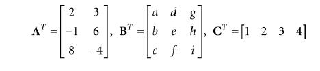

# 矩阵代数

[矩阵代数](#矩阵代数)
- [2.1 定义](#21-定义)
- [2.2 矩阵乘法](#22-矩阵乘法)
- [2.3 转秩矩阵](#23-转秩矩阵)  
- [2.4 单位矩阵](#24-单位矩阵)  
- [2.5](#25)    
- [2.6](#26)  
- [2.7 逆矩阵](#27-逆矩阵)  
- [2.8 DirectX Math 库中的矩阵](#28-directx-math-库中的矩阵)       
  - - [2.8.1 矩阵类](#281-矩阵类)
  - - [2.8.2 矩阵函数](#282-矩阵函数)     
  - - [2.8.3 DirectX Math 库矩阵的例子程序](#283-directx-math-库矩阵的例子程序)
- [2.9 总结](#29-总结)   
- [2.10 练习](#210-练习)


在计算机三维图形领域，我们用矩阵描述几何体的变换，比如，缩放，旋转，平移。也可以改变一个点或向量的坐标，从一个坐标系到另一个坐标系。这一章就将探索矩阵的数学性质。

**学习目标：**

1. 理解矩阵和矩阵的运算
2. 理解如何将向量-矩阵的乘法视为一个线性的组合
3. 学习矩阵的定义，什么是单位矩阵、转秩矩阵和逆矩阵 
4. 熟悉 DirectX 数学库中用于矩阵的类和函数

## 2.1 定义

一个 m x n 的矩阵 M 是一个由 m 行，n 列的实数数组。行和列的数量决定了矩阵的维度。矩阵中的数被称为元素。我们使用元素的行号和列号组成双下标 M<sub>ij</sub> 来定义矩阵中的每个元素，第一个下标是行号，第二个下标是列号。

**例 2.1**

如下矩阵：


1. A 矩阵是一个 4x4 的矩阵；B 矩阵是一个 3x2 的矩阵；u 矩阵是一个 1x3 的矩阵；v 矩阵是一个 4x1 的矩阵
2. 我们定义 A 矩阵中第四行，第二列的元素为 A<sub>42</sub> = -5。 定义 B 矩阵中第二行，第一列的元素为 A<sub>42</sub> = -5。
3. 矩阵 u 和 v 是特数矩阵，因为它们分别只包含一行或一列元素。有时，我称这种矩阵为行向量或列向量，因为它们常用来表示矩阵中的一个向量。对于行向量和列向量，用矩阵的双下标去标识向量元素不是很有必要，所以我们只用单下标。

有时，我们喜欢把向量的一行当成向量来处理。我们可能会这样书写：


这里，A<sub>1,*</sub> = [ A<sub>11</sub>, A<sub>12</sub>, A<sub>13</sub> ]，A<sub>2,*</sub> = [ A<sub>21</sub>, A<sub>22</sub>, A<sub>23</sub> ]，A<sub>3,*</sub> = [ A<sub>31</sub>, A<sub>32</sub>, A<sub>33</sub> ]。这种标识方法，第一个索引代表行号，第二索引用“ * ”号，标识包含这行所有元素的向量。同样，我们用同样的方式标识列：


现在，我们定义矩阵的相等，加法，标量积和减法

1. 矩阵相等，当且仅当两个矩阵每行每列对应元素相等。
2. 矩阵加法，两个矩阵每行每列对应元素相加。
3. 矩阵标量积，将矩阵每个元素都与标量相乘
4. 矩阵减法，根据矩阵加法和标量积，得到 A - b = A + (-B) 

**例 2.2**


## 2.2 矩阵乘法

### 2.2.1 定义

如果 A 是一个 m x n 的矩阵，B 是一个 n x p 的矩阵，我们定义它们的积 AB 是一个 m x p 的矩阵 C 。C 中第 ij 个元素是 A 中第 i 行行向量 A<sub>i,* </sub> 点乘 B 中第 j 列列向量 B<sub>*,j</sub>的结果。（等式 2.1）

> $$ C_{ij} = A_{i,*} · B_{*,j} $$

所以为了矩阵乘法 AB 有意义，我们需要相乘的两个矩阵， A 的列数等于 B 的行数。也就是说，A 中行向量的维数等于 B 中列向量的维数。如果两向量维数不匹配，矩阵点乘就无法进行。

**例 2.3**

**例 2.4**

### 2.2.2 向量与矩阵的乘法

考虑如下向量与矩阵乘法：


注意，这里 uA 的结果是一个 1x3 的行矩阵。使用等式 2.1 等到：（等式 2.2）


等式2.2 是线形结合一个很好的例子，

> 这里有点内容还没翻

### 2.2.3 结合律

矩阵乘法有一些很好的代数性质。例如，矩阵乘法的分配率：A(B + C) = AB + AC，(A + B)C = AC + BC。有时，我们使用矩阵乘法的结合律来交换矩阵相乘的顺序：(AB)C = A(BC)。

## 2.3 转秩矩阵

交换矩阵行和列的元素，就可以得到转秩矩阵。一个 m x n 的矩阵的转秩矩阵是 一个 n x m 的矩阵。矩阵 M 的转秩矩阵表示为 M<sup>T</sup> 。

**例 2.5**

如下矩阵：


转秩矩阵为：



转秩矩阵有如下有用的性质：

1. (A+B)<sup>T</sup> = A<sup>T</sup> + B<sup>T</sup>
2. (cA)<sup>T</sup> = cA<sup>T</sup>
3. (AB)<sup>T</sup> = B<sup>T</sup>A<sup>T</sup>
4. (A<sup>T</sup>)<sup>T</sup> = A
5. (A<sup>-1</sup>)<sup>T</sup> = (A<sup>T</sup>)<sup>-1</sup>

## 2.4 单位矩阵

这里要介绍一种特殊的矩阵，叫做单位矩阵。单位矩阵是一个方形矩阵，它除了主对角线上的元素外，其他的元素全为 0。沿着主对角线上的元素全为 1。

下面是 2x2，3x3，4x4 的单位矩阵：


单位矩阵的作用相当于单位乘法；也就是说，A 是一个 m x n 的矩阵，B 是一个 n x p 的矩阵，I 是一个 n x n 的单位矩阵，那么：

> $$ AI = A; IB = B $$

总之，乘以一个单位矩阵不会改变矩阵本身。单位矩阵也被当成矩阵中的实数 1 。特别地，如果 M 是一个方形矩阵，那么它与单位矩阵相乘，它们之间的顺序可以交换：

> $$ MI = IM = M $$

**例 2.6**

**例 2.7**

## 2.5

## 2.6

## 2.7 逆矩阵

矩阵代数里没有定义除法，但是定义了乘法的逆运算。下面是有关逆运算的总结：

1. 只有方形矩阵能求逆。所以，提到逆矩阵，我们都是处理的方形矩阵。
2. n x n 的矩阵 M 的逆矩阵记为 M<sup>-1</sup>。
3. 不是所有方形矩阵都有逆矩阵。如果一个矩阵有逆矩阵，就称它是可逆的(invertible)。如果没有，就称它为单调递(singular)。
4. 如果逆矩阵存在，这个逆矩阵是唯一的。
5. 一个矩阵乘以它的逆矩阵，结果是单位矩阵：MM<sup>-1</sup> = M<sup>-1</sup>M = I。注意，矩阵和它的逆矩阵相乘可以交换顺序,这是矩阵乘法的特例。

逆矩阵在求解方程组的时候非常有用。例如，给定的矩阵等式 p' = pM ，已知 p 和 M 的值，求 p。假如 M 是可逆矩阵（即，M<sup>-1</sup> 存在），那么可以通过如下步骤求解 p：

> p'=pM<br>
> p'M<sup>-1</sup> = pMM<sup>-1</sup> // 在等式两边同时乘以M<sup>-1</sup> <br>
> p'M = pI // 根据逆矩阵的定义 MM<sup>-1</sup> = I <br>
> p'M = p // 根据单位矩阵的定义 pI = p

这里给出求逆矩阵的公式，我们就不证明了，因为在大学线性代数的课程里都证明过了

> $$ A^{-1} = {A^{*} \over det A} $$

例 2.10

## 2.8 DirectX Math 库中的矩阵

为了变换点和向量，我们使用 1x4 的行向量和 4x4 的矩阵。原因在下一章介绍，这里我们只需要关注这几个表示 4x4 矩阵的类。

### 2.8.1 矩阵类

在 DX 数学库中，用 *XMMATRIX 类* 表示 4x4 矩阵。它被定义在 DirectXMath.h 头文件中（方便表达清楚，我们做了一些细小的改动）：

```
#if (defined(_M_IX86) || defined(_M_X64) || defined(_M_ARM)) && define (_XM_NO_INTRINSICS_)

struct XMMATRIX

#else

__declspec(align(16)) struct XMMATRIX

#endif
{
    // Use 4 XMVECTORs to represent the matrix for SIMD.
    XMVECTOR r[4];
    XMMATRIX() {}

    // Initialize matrix by specifying 4 row vectors.
    XMMATRIX(FXMVECTOR R0, FXMVECTOR R1, FXMVECTOR R2, CXMVECTOR R3)
    { 
        r[0] = R0; r[1] = R1; r[2] = R2; r[3] = R3; 
    }

    // Initialize matrix by specifying 4 row vectors.
    XMMATRIX(float m00, float m01, float m02, float m03,
            float m10, float m11, float m12, float m13,
            float m20, float m21, float m22, float m23,
            float m30, float m31, float m32, float m33);

    // Pass array of sixteen floats to construct matrix.
    explicit XMMATRIX(_In_reads_(16) const float *pArray);
    XMMATRIX& operator= (const XMMATRIX& M)
    { 
        r[0] = M.r[0]; r[1] = M.r[1]; r[2] = M.r[2];
        r[3] = M.r[3]; return *this; 
    }
    XMMATRIX operator+ () const { return *this; }
    XMMATRIX operator- () const;
    XMMATRIX& XM_CALLCONV operator+= (FXMMATRIX M);
    XMMATRIX& XM_CALLCONV operator-= (FXMMATRIX M);
    XMMATRIX& XM_CALLCONV operator*= (FXMMATRIX M);
    XMMATRIX& operator*= (float S);
    XMMATRIX& operator/= (float S);
    XMMATRIX XM_CALLCONV operator+ (FXMMATRIX M) const;
    XMMATRIX XM_CALLCONV operator- (FXMMATRIX M) const;
    XMMATRIX XM_CALLCONV operator* (FXMMATRIX M) const;
    XMMATRIX operator* (float S) const;
    XMMATRIX operator/ (float S) const;
    friend XMMATRIX XM_CALLCONV operator* (float S, FXMMATRIX M);
};
```

我们可以看到，XMMATRIX 使用了四个 XMVECTOR 实例，这样就可以用到 SIMD。而且，XMMATRIX 还提供了运算符的重载，进行基本的矩阵运算。

此外，一个 XMMATRIX 实例也能通过 XMMatrixSet 函数创建：

```
XMMATRIX XM_CALLCONV XMMatrixSet(
    float m00, float m01, float m02, float m03,
    float m10, float m11, float m12, float m13,
    float m20, float m21, float m22, float m23,
    float m30, float m31, float m32, float m33
);
```

就像用 XMFLOAT2(2D) ，XMFLOAT3(3D) ，XMFLOAT4(4D) 存储向量数据一样，DirectXMath 官方文档建议使用 XMFLOAT4X4 类存储矩阵，把矩阵作为该类的一个数据成员。

```
struct XMFLOAT4X4
{
    union
    {
        struct
        {
            float _11, _12, _13, _14;
            float _21, _22, _23, _24;
            float _31, _32, _33, _34;
            float _41, _42, _43, _44;
        };
        float m[4][4];
    };

    XMFLOAT4X4() {}

    XMFLOAT4X4( float m00, float m01, float m02, float m03,
                float m10, float m11, float m12, float m13,
                float m20, float m21, float m22, float m23,
                float m30, float m31, float m32, float m33);

    explicit XMFLOAT4X4(_In_reads_(16) const float *pArray);

    float operator() (size_t Row, size_t Column) const 
    { 
        return m[Row][Column]; 
    }

    float& operator() (size_t Row, size_t Column) 
    {
        return m[Row][Column]; 
    }

    XMFLOAT4X4& operator= (const XMFLOAT4X4& Float4x4);
};
```

### 2.8.2 矩阵函数

DX 数学库包含了如下一些有用的矩阵相关的函数：

```
XMMATRIX XM_CALLCONV XMMatrixIdentity(); // 返回单位矩阵 I

bool XM_CALLCONV XMMatrixIsIdentity( FXMMATRIX M); // 如果 M 是单位矩阵，返回 true

XMMATRIX XM_CALLCONV XMMatrixMultiply(FXMMATRIX A, CXMMATRIX B); // 返回矩阵 AB 的积

XMMATRIX XM_CALLCONV XMMatrixTranspose(FXMMATRIX M); // 返回 M 的转秩矩阵

XMVECTOR XM_CALLCONV XMMatrixDeterminant(FXMMATRIX M); // 返回(det M, det M, det M, det M)

XMMATRIX XM_CALLCONV XMMatrixInverse( XMVECTOR* pDeterminant, FXMMATRIX M); // 返回 M 的逆矩阵
```

当我们声明一个函数的 XMMATRIX 类型的参数时，和声明 XMVECTOR 类型参数一样（详见 1.6.3），我们遵循同样的参数传递规则，只是一个 XMMATRIX 计为四个 XMVECTOR 参数。假设函数总计不超过两个额外的 FXMVECTOR 参数，第一个 XMMATRIX 参数必须是 FXMMATRIX 类型，其他的 XMMATRIX 必须是 CXMMATRIX 类型。我们说明一下这些类型在32位的 Windows 平台，编译器支持 __fastcall 调用约定和更新的 __vectorcall 调用约定下，是如何定义的：

```
// 32-bit Windows __fastcall passes first 3 XMVECTOR arguments
// via registers, the remaining on the stack.
typedef const XMMATRIX& FXMMATRIX;
typedef const XMMATRIX& CXMMATRIX;

// 32-bit Windows __vectorcall passes first 6 XMVECTOR arguments
// via registers, the remaining on the stack.
typedef const XMMATRIX FXMMATRIX;
typedef const XMMATRIX& CXMMATRIX;
```

注意使用 __fastcall 的32位 Windows 平台，XMMATRIX 不能传给 SSE/SSE2 寄存器，因为只有三个 XMVECTOR 参数才支持寄存器传递，而 XMMATRIX 需要四个；而且矩阵只能以引用的形式传递到栈上。这些类型在其他平台的定义，详见官方文档。构造函数的参数类型不遵循这些规则，官方文档建议仅使用 CXMMATRIX 类型，且不要使用 XM_CALLCONV 注解在构造函数上。

### 2.8.3 DirectX Math 库矩阵的例子程序

下面的例子告诉你如何使用 XMMATRIX 类，几乎所有用到的函数在之前的内容中都有讲解：

```
#include <windows.h> // for XMVerifyCPUSupport
#include <DirectXMath.h>
#include <DirectXPackedVector.h>
#include <iostream>
using namespace std;
using namespace DirectX;
using namespace DirectX::PackedVector;

// Overload the “<<” operators so that we can use cout to
// output XMVECTOR and XMMATRIX objects. 
ostream& XM_CALLCONV operator << (ostream& os, FXMVECTOR v)
{
    XMFLOAT4 dest;
    XMStoreFloat4(&dest, v);
    os << “(” << dest.x << “, ” << dest.y << “, ” <<
    dest.z << “, ” << dest.w << “)”;
    return os;
}

ostream& XM_CALLCONV operator << (ostream& os, FXMMATRIX m)
{
    for (int i = 0; i < 4; ++i)
    {
        os << XMVectorGetX(m.r[i]) << ″\t”;
        os << XMVectorGetY(m.r[i]) << “\t”;
        os << XMVectorGetZ(m.r[i]) << “\t”;
        os << XMVectorGetW(m.r[i]);
        os << endl;
    }
    return os;
}

int main()
{
    // Check support for SSE2 (Pentium4, AMD K8, and above).
    if (!XMVerifyCPUSupport())
    {
        cout << “directx math not supported” << endl;
        return 0;
    }

    XMMATRIX A( 1.0f, 0.0f, 0.0f, 0.0f,
                0.0f, 2.0f, 0.0f, 0.0f,
                0.0f, 0.0f, 4.0f, 0.0f,
                1.0f, 2.0f, 3.0f, 1.0f);

    XMMATRIX B = XMMatrixIdentity();
    XMMATRIX C = A * B;
    XMMATRIX D = XMMatrixTranspose(A);
    XMVECTOR det = XMMatrixDeterminant(A);
    XMMATRIX E = XMMatrixInverse(&det, A);
    XMMATRIX F = A * E;

    cout << “A = ” << endl << A << endl;
    cout << “B = ” << endl << B << endl;
    cout << “C = A*B = ” << endl << C << endl;
    cout << “D = transpose(A) = ” << endl << D << endl;
    cout << “det = determinant(A) = ” << det << endl << endl;
    cout << “E = inverse(A) = ” << endl << E << endl;
    cout << “F = A*E = ” << endl << F << endl;
    return 0;
}
```

## 2.9 总结

暂时不译

## 2.10 练习

暂时不译

