# 变换

[变换](#变换)
- [3.1 线性变换](#31-线性变换)
- - [3.1.1 定义](#311-定义)
- - [3.1.2 矩阵表示](#312-矩阵表示)
- - [3.1.3 缩放](#313-缩放)
- - [3.1.4 旋转](#314-旋转)
- [3.2 仿射变换](#32-仿射变换)
- - [3.2.1 齐次坐标](#321-齐次坐标)
- - [3.2.2 定义和矩阵表示](#322-定义和矩阵表示)
- - [3.2.3 平移](#323-平移)
- - [3.2.4 缩放和旋转的仿射变换](#324-缩放和旋转的仿射变换)
- - [3.2.5 仿射变换的几何解释](#325-仿射变换的几何解释)
- [3.3 变换组合](#33-变换组合)
- [3.4 坐标系变换](#34-坐标系变换)
- - [3.4.1 向量](#341-向量)
- - [3.4.2 点](#342-点)
- - [3.4.3 矩阵表达](#343-矩阵表达)
- - [3.4.4 坐标系变换矩阵的结合](#344-坐标系变换矩阵的结合)
- - [3.4.5 坐标系变换矩阵的逆矩阵](#345-坐标系变换矩阵的逆矩阵)
- [3.5 变换矩阵 VS 坐标变换矩阵](#35-变换矩阵-vs-坐标变换矩阵)
- [3.6 DirectX Math 库的转换函数](#36-directx-math-库的转换函数)
- [3.7 总结](#37-总结)
- [3.8 练习](#38-练习)

我们以几何的方式描述三维世界的物体；就是用一组三角形近似的模拟物体的外表面。如果，我们的物体静止不动，那么场景就会变得索然无趣。所以，我们需要学习让物体动起来的方法；常见的几何变换包括平移、旋转和缩放。这一章，我们构建矩阵等式，我们能用它们对三维空间中的点和向量进行变换。

**学习目标**

1. 学习线性变换和仿射变换如何用矩阵表示
2. 学习用于缩放、旋转和平移几何体的坐标变换
3. 理解如何通过矩阵-矩阵乘法将多个变换矩阵组合位也给净变换矩阵
4. 了解如何将坐标从一个坐标系变换到另一个坐标系，以及如何通过一个矩阵来描述坐标变换
5. 熟悉用于创建矩阵变换的 DirectX Math 函数

## 3.1 线性变换

### 3.1.1 定义

思考这样一个数学函数 T(**v**) = T(x,y,z) = T(x',y',z')。这个函数输入一个三维向量，然后输出一个三维向量。我们就说 T 是一个线性变换当且仅当如下条件成立（等式3.1）:

> $$ T(u+v) = T(u)+T(v) $$
> $$ T(ku)=kT(u) $$
> $$ u=(u_x,u_y,u_z) 和 v=(v_x,v_y,v_z) 是三维向量，k 是标量 $$

**例 3.1**

### 3.1.2 矩阵表示

令 u=(x,y,z)。我们能将这个向量如下写：

> u = (x,y,z) = xi + yj + zk = x(1,0,0) + y(0,1,0) + z(0,0,1)

向量 i=(1,0,0)，j=(0,1,0)，k=(0,0,1)，这三个单位向量分别指向坐标轴的三个轴方向，它们被称为标准基向量 R<sup>3</sup>。（R<sup>3</sup>表示所有三维向量(x,y,z)的集合）。现在，使 T 成为一个线性变换，我们有（等式 3.3）：

> $$ T(u) = T(xi+yj+zk) = xT(i) + yT(j) + zT(k) $$

注意，这里没有更多的线性组合

> 这里还没翻译完

### 3.1.3 缩放

缩放是指改变一个物体的尺寸大小，如图3.1

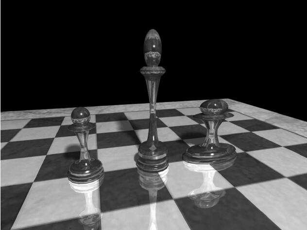

我们定义缩放变化：

> $$ S(x,y,x) = (s_xx, s_yy, s_zz) $$

s<sub>x</sub> 相对于当前坐标系的 x 轴缩放向量，s<sub>y</sub> 相对于 y 轴，s<sub>z</sub> 相对于 z 轴。我们现在证明S确实是一个线性变换。我们有：

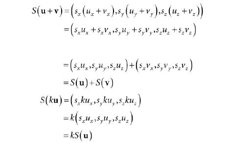

等式3.1的性质都满足，所以缩放变换是线性变换。而且存在矩阵表示。为了找到这个矩阵表示，我们缩放变换运用到标准基坐标上，如等式 3.3，然后把结果向量放到一个行向量中（如等式 3.4）:

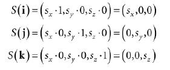

因此缩放的变换矩阵表示为：

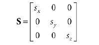

我们称这个矩阵为缩放矩阵。

缩放矩阵的逆矩阵为：

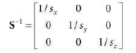

**例 3.2**

### 3.1.4 旋转

在这一节，我们描述一个向量绕轴 n 旋转 θ 角；如图3.3。是沿着 n 的方向看去，顺时针旋转的角度；而且我们假设||n||=1；

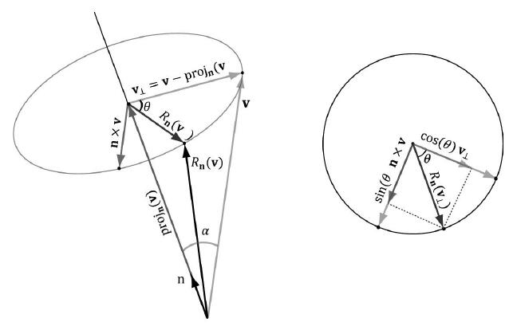

首先，我们将 v 拆封成两个分量：一个分量平行于 n ，另一个分量垂直于 n。平行的分量表示为 proj<sub>n</sub>(v)（详见例 1.5）；垂直的分量计算得，v<sub>⊥</sub> = perpn(v) = v – proj<sub>n</sub>(v)。（详见例 1.5）。问题的关键是分量 proj<sub>n</sub>(v) 平行于 n，旋转之后没有变换，所以我们只需要解决如何旋转垂直分量。旋转之后的向量为 R<sub>n</sub>(v) = proj<sub>n</sub>(v) + R<sub>n</sub>(v<sub>⊥</sub>)。如图 3.3。

为了找到 R<sub>n</sub>(v<sub>⊥</sub>) ，我们在旋转平面上设置一个二维坐标系。

**例 3.3**

## 3.2 仿射变换

### 3.2.1 齐次坐标

我们将在下一节介绍仿射变换，仿射变换是和平移相关的线性变换。但是，向量的平移是没有意义的，因为向量描述的是大小和方向，而不表示位置；换句话说，向量经过平移变换后，并不会有任何改变。这里的平移是应用在点（位置向量）上。齐次坐标提供了一种便捷的符号机制，使我们能将点和向量一致对待。有了齐次坐标，我们将向量和点增加成四元组，在第四位 w-坐标 存放标志位，区分点和向量。就像这样：

1. (x, y, z, 0) 表示向量
2. (x, y, z, 1) 表示点

一会我们将解释将 w=1 表示点，可以使我们的平移变换计算无误；将 w=0 表示向量，可以避免平移变换改变我们的向量坐标。（我们不希望平移向量的坐标，这样会改变它的方向和大小——平移不能改变向量的性质）。

### 3.2.2 定义和矩阵表示

一个线性变换不能满足所有我们想要的变换；所以，我们扩充我们的函数，名为**仿射变换**。一个仿射变换是一个线性变换加一个平移向量b；表示为：


矩阵表达式为：

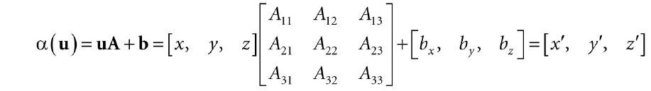

其中，A 辩时线性变换矩阵。

如果我们改写为 w=1 的齐次坐标，我们就会得到一个更加紧凑的表达式（等式 3.6）：

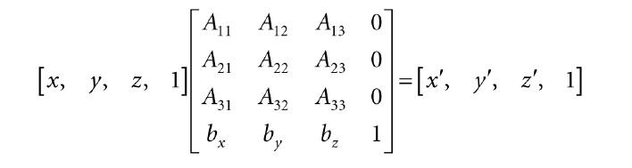

等式3.6 中， 4x4 的矩阵代表仿射变换。

注意，加上的向量 b 本质上是平移变换。我们不希望将平移作用到向量上。但是，我仍想将线性变换的部分作用到向量上。如果我们设置将向量的第四个分量 w 设置为 0 ，平移变换 b 将不会作用到向量上（可以通过向量乘法规则证明）。

### 3.2.3 平移

单位变换是不改变输入参数的线性变换，就像这样，I(u)=u。它意味着，表示这个线性变换的矩阵是一个单位矩阵。

现在，我们可以定义平移变换是一个线性变换部分是单位变换的仿射变换；就像这样：

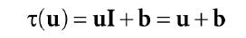

我们可以发现，单纯地将点 u 平移（或位移）b 个单位。如图3.5，表明

> 没译完

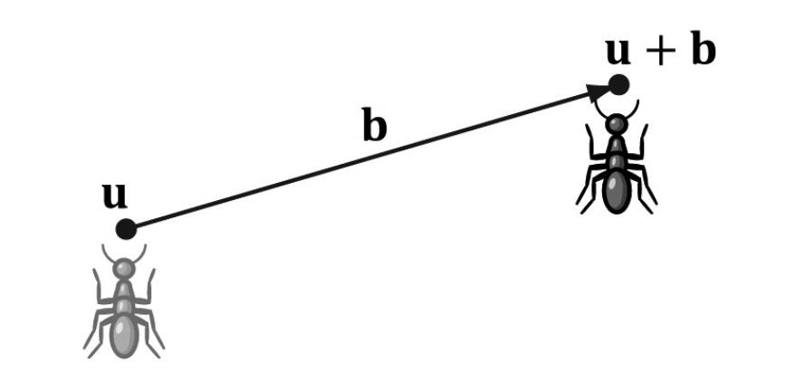

等式3.6中，τ 有矩阵表示：

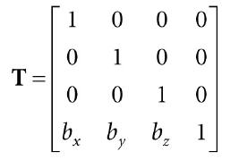

它被成为平移矩阵。

平移矩阵的逆矩阵为：

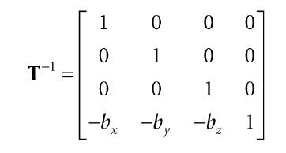

**例 3.4**

### 3.2.4 缩放和旋转的仿射变换

注意，如果 **b** = 0，仿射变换就会退化成线性变换。因此，我们可以将所有的线性变换改写成 b=0 的仿射变换。例如，缩放和旋转分别用 4x4 的矩阵表示为：

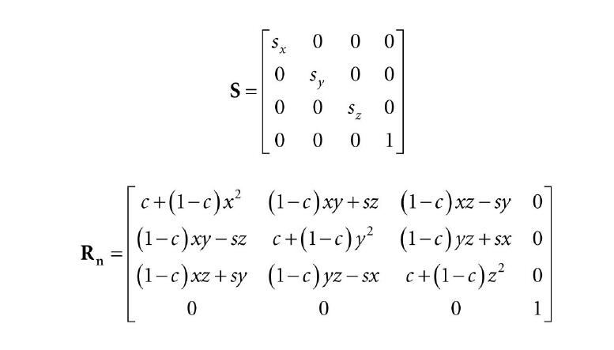

通过这种方式，我们能将所有的变化都用 4x4 的举证表示。点和向量用 1x4 的齐次行向量表示。

### 3.2.5 仿射变换的几何解释

## 3.3 变换组合

设 S 是缩放矩阵，R是旋转矩阵，T是平移矩阵。假设有一个正方体由八个顶点 v<sub>i</sub>，i=0,1,...,7 组成，我们希望将三种变换正确地作用到每一个点上。最简单的方法是按部就班的执行每一种变换：

> $$ ((v_iS)R)T = (v_i'R)T = v_i''T = v_i'''  $$

但是，向量的乘法是可结合的，它能等价地表示为：

> $$ v_i(SRT) = v_i''' $$

我们令矩阵 C = SRT，它将三种变换封装到一个变换矩阵里面。总之，矩阵-矩阵的乘法，可以将所有的变换合并起来。

这样做有助于提高效率。比如，一个 3D 模型由20000个点组成，我们想对这个模型进行这三种几何变换。如果按部就班的做，我们需要做 20000x3 此向量-矩阵乘法。如果我们使用结合后的变化矩阵去做，就只需要 20000 次向量-矩阵的乘法和 2 次矩阵-矩阵的乘法。很明显，相较于后面大量的向量-矩阵乘法，两次额外的矩阵-矩阵乘法的开销就非常不值一提。

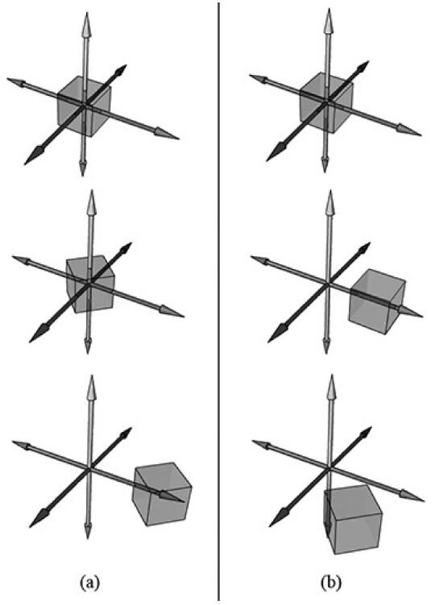

> 这里需要指出矩阵乘法是不可交换的。从几何学上也可以解释。例如，先旋转再平移，可以通过矩阵乘积 RT 表示，这个结果和先进行同样的平移再进行同样的旋转得到的结果 TR 不一样，如上图所示。

## 3.4 坐标系变换

水的沸点是 100 摄氏度。在华氏度下，水的沸点又如何表示？总之，它们都是一个数量，它们的不同只是因为单位的不同。为了转换单位，我们需要知道摄氏度与华氏度之间的关系，它们之间的关系是：

> $$ T_F = {9 \over 5} T_C + 32 $$

因此，水的沸点是 212 华氏度。

这个例子表明，我们能将在 A 单位下的标量 k 转换到 B 单位下的标量 k' ，它们都表示同一个量，再此之前需要告知这两个量之间的关系。在下面的小节里，我们将面临同样的问题，但不是标量，我们将聚焦于如何转换点或向量的坐标，从一个坐标系到另一个坐标系。我们称这种变换为坐标系转换。

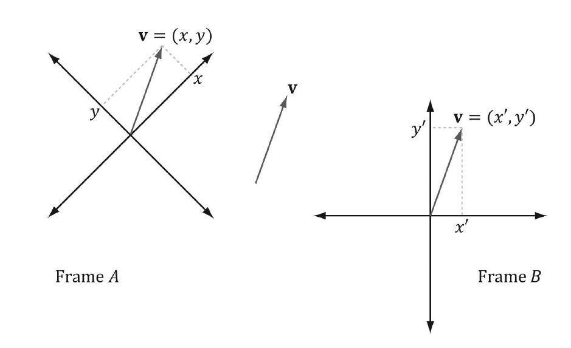

值得强调的是，在坐标系变换过程中，我们不认为是几何上的变换；而是改变了坐标的参考系，从而改变几何体的坐标表示。这与旋转，平移和缩放不同，这三种变换是物理上的移动或几何上的变形。

在三维计算机图形学中，我们会应用多种坐标系，所以我们需要知道如何从一个坐标系转换到另一个坐标系。因为位置是点的属性，但不是向量的属性，所以坐标系的转换对点和向量来说都是不一样的。

### 3.4.1 向量

如图3.11，有两个坐标系 A 和 B 还有一个向量 p 。假设在 A 坐标系下 p 的坐标 p<sub>A</sub> = (x,y)，我们希望找到在 B 坐标系下的坐标 p<sub>B</sub> = (x',y') 。换句话说，给定一个向量相对于一个坐标系下的坐标，如何找到这个向量在另一个坐标下的坐标？

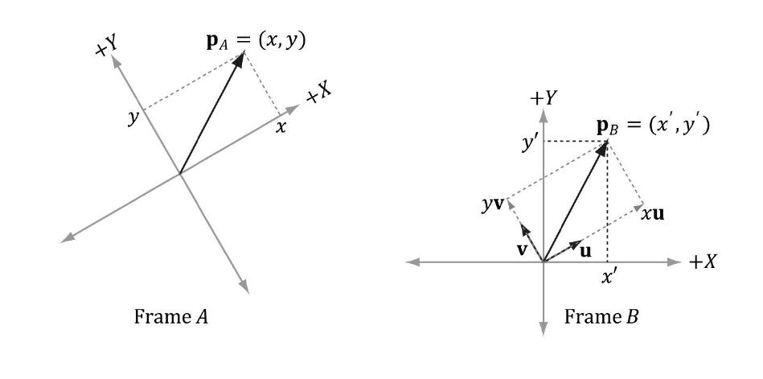

从图3.11中，可以清楚的看到：

> **p** = x**u** + y**v**

其中，**u** 和 **v** 分别是在 A 坐标系下指向 x轴 和 y轴 的单位向量。在 B 坐标系下，上式中的每个向量可以表达为：

> **p<sub>B</sub>** = x**u<sub>B</sub>** + y**v<sub>B</sub>**

所以，如果给定 **p<sub>A</sub>** = (x, y) ，已知 B 坐标系下的向量 **u** 和 **v** 的坐标，这意味着，如果我们已知 **u<sub>B</sub>** = (u<sub>x</sub>, u<sub>y</sub>) 和 **v<sub>B</sub>** = (v<sub>x</sub>, v<sub>y</sub>) ， 然后我们总能找到 **p<sub>B</sub>** = (x', y')。

推广到三维坐标，如果已知 **p<sub>A</sub>** = (x, y, z)，那么

> **p<sub>B</sub>** = x**u<sub>B</sub>** + y**v<sub>B</sub>** + z**w<sub>B</sub>**

其中，**u**，**v**，**w** 分别指向 A 坐标系的 x轴，y轴，z轴。

### 3.4.2 点

点的坐标系变换与向量的坐标系变换有些许不同；因为位置信息对点来说很重要，所以我们不能像图3.11那样转换点。

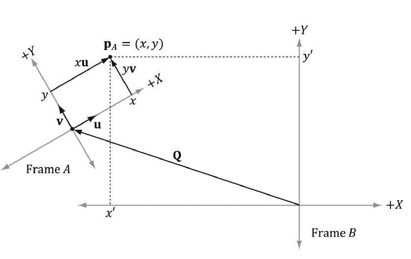
> 图3.12 找出 B 坐标系下向量 p 的坐标

图3.12 展示了这种情形，我们能看到点 p 能用如下等式表达：

> **p** = x**u** + y**v** + **Q**

其中 u 和 v 分别是指向 A 坐标系的 x轴 和 y轴，Q 是 A 坐标系的原点。在 B 坐标系下，上式可以表达为：

> **p** = x**u<sub>B</sub>** + y**v<sub>B</sub>** + **Q<sub>B</sub>**

因此，如果给定 **p<sub>A</sub>** = (x, y) ，已知向量 u，v 和 原点Q 在 B 坐标系下的坐标，也就是如果已知 u<sub>B</sub> = (u<sub>x</sub>, u<sub>y</sub>)，v<sub>B</sub>=(v<sub>x</sub>, v<sub>y</sub>)，和 Q<sub>B</sub> = (Q<sub>x</sub>, Q<sub>y</sub>)，那么我们能求出 p<sub>B</sub> = (x', y')。

推广到三维坐标系，如果 p<sub>A</sub> = (x, y, z)，那么

> **p<sub>B</sub>** = x**u<sub>B</sub>** + y**v<sub>B</sub>** + z**w<sub>B</sub>** + **Q<sub>B</sub>**

其中 u，v，w分别指向 A 坐标系的 x轴，y轴，z轴，Q 是 A 坐标系的原点。

### 3.4.3 矩阵表达

回顾到目前有关点和向量的坐标转换：

> (x', y', z') = x**u<sub>B</sub>** + y**v<sub>B</sub>** + z**w<sub>B</sub>** 向量 <br>
> (x', y', z') = x**u<sub>B</sub>** + y**v<sub>B</sub>** + z**w<sub>B</sub>** + **Q<sub>B</sub>** 点

如果我们使用齐次坐标系，那么我们能通过一个等式表达向量和点（等式3.8）：

> (x', y', z'，w) = x**u<sub>B</sub>** + y**v<sub>B</sub>** + z**w<sub>B</sub>** + w**Q<sub>B</sub>**

如果 w=0，等式为向量的坐标系变换；如果 w=1，那么等式为点的坐标系变换。利用等式3.8，正确设置 w坐标，它能同时运用在向量和点上；而不再需要两个等式（一个针对向量，一个针对点）。等式2.3 说明，我们将 等式3.8 写成矩阵表达式（等式3.9）：

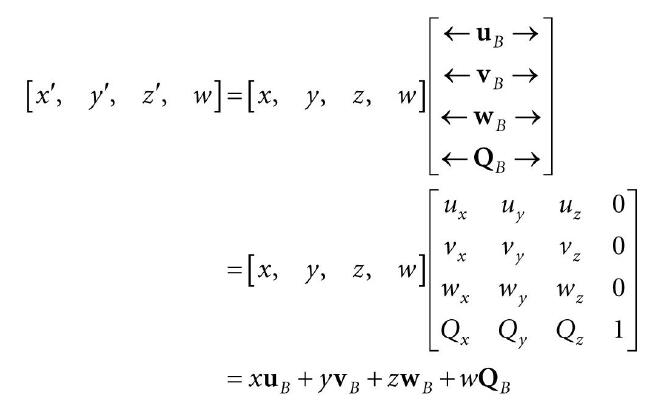

其中 Q<sub>B</sub> = (Q<sub>x</sub>, Q<sub>y</sub>, Q<sub>z</sub>, 1)，u<sub>B</sub> = (u<sub>x</sub>, u<sub>y</sub>, u<sub>z</sub>, 0)，v<sub>B</sub> = (v<sub>x</sub>, v<sub>y</sub>, v<sub>z</sub>, 0)，w<sub>B</sub> = (w<sub>x</sub>, w<sub>y</sub>, w<sub>z</sub>, 0)，表示在 B 坐标系下，A坐标系的原点和坐标轴的齐次坐标。我们称这个 4
x4 矩阵为坐标系变换矩阵，我们称它将 A 坐标系下的坐标转换（映射）到 B 坐标系下。

### 3.4.4 坐标系变换矩阵的结合

假设我们现有三个坐标系 F、G、H，同时令 A 为从 F 到 G 的坐标系变换矩阵，B 为从 G 到 H 的坐标变换矩阵。假设我们已知向量在F坐标系下的坐标为 **p<sub>F</sub>** ，我们想要知道同一个向量在 H 坐标系下的坐标，也就是想知道 p<sub>H</sub>。方式一是按部就班的执行：

> (p<sub>F</sub>A)B = p<sub>H</sub> <br>
> (p<sub>G</sub>)B = p<sub>H</sub>

但是，因为矩阵乘法可结合的，我们能改写等式 (p<sub>F</sub>A)B = p<sub>H</sub> ：

> p<sub>F</sub>(AB) = p<sub>H</sub>

在这种情况下，矩阵积 C = AB 能表示从 F 坐标系直接变换到 H 坐标系；它将 A 变换和 B 变换结合到一个变换矩阵中。

这样做同样是出于对效率的考量。

### 3.4.5 坐标系变换矩阵的逆矩阵

假设给定 p<sub>B</sub>（向量 p 在坐标系 B 下的坐标），已知从 A 坐标系到 B 坐标系的变换矩阵；也就是，p<sub>B</sub> = p<sub>A</sub>M。我们想得到 p<sub>A</sub>。换句话说，现在我们不是解决从 A 坐标系变换到 B 坐标系，而是想要从 B 坐标系变换到 A 坐标系的变换矩阵。为了找到这个矩阵，假设 M 是可逆的。

> p<sub>B</sub> = p<sub>A</sub>M<br>
> p<sub>B</sub>M<sup>-1</sup> = p<sub>A</sub>MM<sup>-1</sup><br>
> p<sub>B</sub>M<sup>-1</sup> = p<sub>A</sub>I<br>
> p<sub>B</sub>M<sup>-1</sup> = p<sub>A</sub>

因此矩阵 M<sup>-1</sup> 是从 B 到 A 的坐标系变换矩阵。

图3.13 表明了变换矩阵和它的逆矩阵之间的关系。值得注意的是本书中所有的变换矩阵都是可逆的，读者可以不用担心这个逆矩阵是否存在。

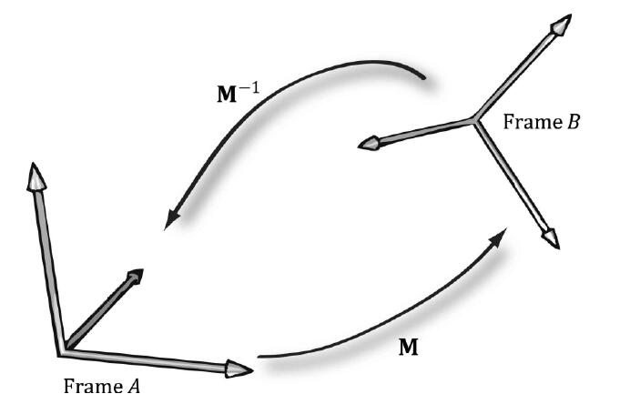

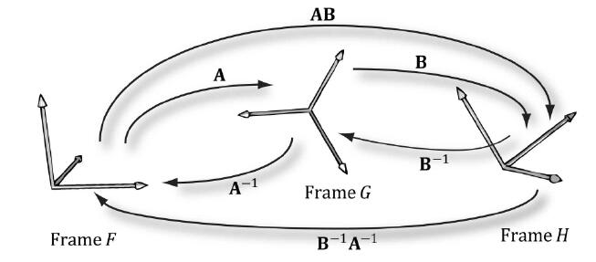

## 3.5 变换矩阵 VS 坐标变换矩阵

目前位置，我们已经区分了两种转换，“动态”变换（缩放、旋转、平移）和坐标系变换。在这一节，我们将会看到这两种变换在数理上是等价的，动态变换也能解释成坐标系变换，反之亦然。

在图3.15，展示了等式3.7（先旋转后平移的仿射变换矩阵） 和 等式3.9（坐标系变换矩阵） 在几何上的相似性。

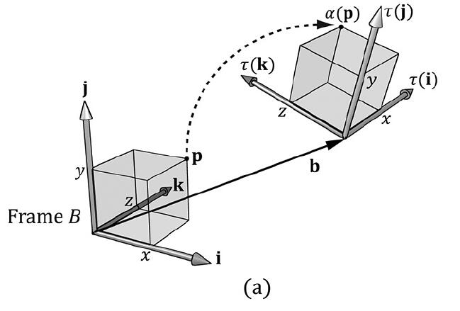

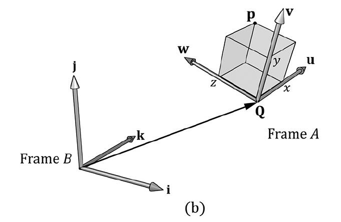

仔细思考一下，它就想得通了。对于坐标系变换，坐标系之间的不同在于它们的位置和方向上的不同。因此，从一坐标系变换到另一个坐标系的数学转换公式实则需要旋转和平移坐标系，所以我们得到了和直接平移旋转的变换相同的数学公式。另一种解释是，我们最后都得到了同样的数字结果；只是我们用了不同的方式描述这个过程。一些情况下，

> 这里还有一些话没翻译，感觉有点废话

## 3.6 DirectX Math 库的转换函数

我们总结了 DirectX 数学库中有关转换的函数，以供参考。

```
// Constructs a scaling matrix:
XMMATRIX XM_CALLCONV XMMatrixScaling(float ScaleX, float ScaleY, float ScaleZ); // Scaling factors

// Constructs a scaling matrix from components in vector:
XMMATRIX XM_CALLCONV XMMatrixScalingFromVector( FXMVECTOR Scale); // Scaling factors (sx, sy, sz)

// Constructs a x-axis rotation matrix Rx:
XMMATRIX XM_CALLCONV XMMatrixRotationX(float Angle); // Clockwise angle θ to rotate

// Constructs a y-axis rotation matrix Ry:
XMMATRIX XM_CALLCONV XMMatrixRotationY(float Angle); // Clockwise angle θ to rotate

// Constructs a z-axis rotation matrix Rz:
XMMATRIX XM_CALLCONV XMMatrixRotationZ(float Angle); // Clockwise angle θ to rotate

// Constructs an arbitrary axis rotation matrix Rn:
XMMATRIX XM_CALLCONV XMMatrixRotationAxis( FXMVECTOR Axis, float Angle); // Clockwise angle θ to rotate

// Constructs a translation matrix:
XMMATRIX XM_CALLCONV XMMatrixTranslation(float OffsetX,float OffsetY,float OffsetZ); // Translation factors

// Constructs a translation matrix from components in a vector:
XMMATRIX XM_CALLCONV XMMatrixTranslationFromVector(FXMVECTOR Offset); // Translation factors (tx,ty, tz)

// Computes the vector-matrix product vM where vw = 1 for transforming points:
XMVECTOR XM_CALLCONV XMVector3TransformCoord(FXMVECTOR V, CXMMATRIX M); // Input M

// Computes the vector-matrix product vM where vw = 0 for transforming vectors:
XMVECTOR XM_CALLCONV XMVector3TransformNormal(FXMVECTOR V, CXMMATRIX M); // Input M
```

## 3.7 总结

暂时不译

## 3.8 练习

暂时不译